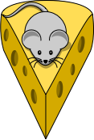

# CheeseWatch - Don't Move The Cheese

**CheeseWatch** is a simple public information change monitor that performs
a series of simple tasks on a schedule. The output of each task is
stored under the `results/` directory in the repo.  The next time the tasks
are run the new output is compared to the old.

If the result is different, the mouse gets very angry and notifications
are sent.   The next time the job runs it will expect whatever was returned
last time.

## Security and Privacy

All information monitored by CheeseWatch must be **public** and
well known.

**Good Use**:
* External DNS queries
* Public TLS Certificate information
* Something you would be comfortable putting on a billboard

**Bad Use**:
* Anything requiring authentication to access
* Anything identifying a person (email address, name, home IP address, etc)
* Something you would not be comfortable putting on a billboard

## Jobs

Each job must return a consistent result.   Sort your output,
don't include time or other things that change, etc.

Keep the mouse happy.

## Modifying

Remember that Cheese Watch modifies its own repo as it makes checks.
Pull a fresh copy of the branch you wish to modify before committing
changes.

## Local Testing

Use `act` - https://github.com/nektos/act
